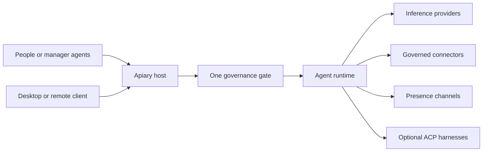

# Apiary

**Create AI team members that remember, use your tools, and stay under your
control.**

Apiary turns an AI chat into an ongoing helper you can actually manage. Give an
agent a job, a personality, memory, and access to the services it needs. It can
then help from your computer, a private server, or connected messaging apps
without starting from scratch each time.

You choose the AI model and every tool the agent can use. You can make a
connection read-only, allow writing when needed, set spending limits, and
decide who may operate or change the agent. Changing models or moving to
another machine does not erase the agent's identity, instructions, or history.

[](https://github.com/prellr/apiary/actions/workflows/ci.yml)
[](LICENSE)

> Apiary is under active development. Its core desktop, server, connector,
> memory, skills, remote access, and portability features work today, but setup
> and configuration may still change before the first stable release.

## Why Apiary

Most AI assistants are temporary conversations controlled by one provider.
Apiary is designed for durable agents that belong to you:

- **They remember.** Each agent can carry useful history and retrieve older
  context when it is relevant.
- **They can do real work.** You may connect files, websites, Git repositories,
  messaging services, MCP tools, or larger agent runtimes.
- **They are portable.** Models, providers, computers, and runtimes can change
  without creating a new agent.
- **Their access is explicit.** An agent only receives tools and permissions
  that a manager approves, and it cannot grant itself more.
- **Management can be scoped.** Different people or manager agents can control
  the whole Apiary host or only the individual agents assigned to them.

## How an Apiary agent works

Each agent keeps five things separate from whichever AI model it uses:

| Part | In everyday terms |
| --- | --- |
| Identity | A stable, portable identity backed by Nostr |
| Role and rules | Its job, personality, behavior, and boundaries |
| Memory | Its signed history and locally retrieved context |
| Tools and AI | The approved models, services, skills, and runtimes it may use |
| Management | The people or manager agents allowed to operate or change it |

The AI model is the engine, not the agent. You can change the engine without
replacing the agent, and the engine cannot change its own permissions.

### Technical shape



Approved changes are kept as signed, portable records. The host reduces those
records to one fast authorization decision before work begins. Task history,
health, spending, search indexes, and interface state stay off-chain so normal
operation remains responsive.

## What works today

- **Desktop and headless operation** — run Apiary locally, on a server, or use
  the desktop app through an SSH tunnel.
- **Replaceable inference** — Anthropic, OpenAI-compatible providers, xAI,
  Ollama, local endpoints, and mock inference with per-agent routing.
- **Governed tools** — built-in web, files, Git, Markdown vaults, Nostr, and
  MCP connectors. Write access is explicit and optional.
- **Portable skills** — standard `SKILL.md` instructions become ratified agent
  capabilities; missing connector requirements fail closed.
- **Durable memory** — signed, chained event history with public, self, and
  local privacy tiers plus semantic retrieval.
- **Multi-channel presence** — Buzz, Telegram, Slack, and external channel
  plugins share the same runtime and policy checks.
- **Per-agent harness policy** — ACP harnesses such as Claude Code, Goose, or
  Berd may be isolated, curated, fully enabled, sandboxed, metered, or denied
  for each agent independently.
- **Scoped management** — multiple Nostr identities can manage the host or
  individual agents as viewers, operators, editors, or governors.
- **Portable agents** — export, transfer, import, and relay-based recovery
  verify identity, signatures, history, and ratification before activation.
- **Management over MCP** — an outside agent can inspect and manage permitted
  Apiary environments without bypassing the normal authorization gate.
- **OpenBot / AG-UI surface** — an Apiary agent can be registered as an
  [OpenBot](https://github.com/CopilotKit/openbot) coworker through standard
  AG-UI without importing OpenBot's tools or standing role as authority.

## Quick start

### Desktop

Requirements: a current Rust toolchain and the platform dependencies required
by [Tauri 2](https://v2.tauri.app/start/prerequisites/).

```bash
git clone https://github.com/prellr/apiary.git
cd apiary
cargo run -p apiary-desktop
```

On macOS, build the persistent signed executable with:

```bash
scripts/build-desktop.sh
```

This produces `target/release/Apiary` with a stable signing identifier so
macOS Keychain does not treat every rebuild as a different application.

For a distributable macOS app and DMG, install Tauri CLI 2 and run the release
packager:

```bash
cargo install tauri-cli --version '^2' --locked
scripts/package-macos.sh
```

The release packager requires a Developer ID Application identity and Apple
notarization credentials. See [docs/RELEASE.md](docs/RELEASE.md) for the
fail-closed release checklist and the explicit local-test override.

### CLI

```bash
cargo build

# Development-only keystore passphrase. The desktop uses macOS Keychain.
export APIARY_PASSPHRASE='choose-a-passphrase'

# Create and ratify an agent.
target/debug/apiary agent new --name scout --suspend-key npub1…
target/debug/apiary agent ratify <agent-npub> --as <manager-npub>

# Run a governed task and verify its signed history.
target/debug/apiary run <agent-npub> --task "Summarize your purpose"
target/debug/apiary log verify <agent-npub>
```

State lives in `~/.apiary` unless `APIARY_HOME` is set. Never commit that
directory.

## Local and remote backends

The desktop normally embeds a loopback-only Apiary host. To keep agents and
credentials on a server, start the daemon there:

```bash
apiary-hostd --bind 127.0.0.1:7777 --auth open
```

In the desktop app, open **Host status**, add the SSH server, and select
**Switch**. Apiary creates a noninteractive loopback tunnel; inference,
credentials, files, channels, and agent state remain on the server.

Keep an `open` daemon bound to server loopback. Use `--auth nip98` whenever a
host is reachable beyond a trusted SSH boundary.

For a browser-facing NIP-98 host, the cockpit asks a NIP-07 signer once and
opens an eight-hour, in-memory session. The session is only an authentication
cache: the signer still sees only agents where its Nostr ID has a ratified
role, and host-wide operations still require host-manager status.

## Governance in practice

- New agents do not run until a manager ratifies their manifest.
- Constitutional or capability changes suspend the agent until ratified again.
- Host managers control installation-wide operations; agent managers are
  scoped to named agents.
- An agent can be a manager of another agent, but cannot govern itself.
- Connectors and harnesses are default-deny. A model request cannot expand a
  ratified grant.
- Credentials are encrypted to the receiving agent and opened only when used.
- Memory, tool results, files, and channel messages are treated as data, not
  trusted instructions.
- Daily model budgets reserve tokens before inference. Harnesses with unknown
  usage must be explicitly estimated or intentionally marked unmetered.

## Connectors, skills, and harnesses

These are deliberately separate:

| Mechanism | Purpose | Authority |
| --- | --- | --- |
| Connector | Gives an agent access to a service or local resource | Named, ratified grant with read/write limits |
| Skill | Teaches a repeatable workflow | Ratified `SKILL.md`; grants no tools itself |
| Harness | Supplies a complete external agent runtime | Per-agent access, profile, sandbox, and metering policy |

Harness policy can expose only inference, a curated tool set, or the harness's
full native surface. Its profile can be isolated from global credentials and
extensions or intentionally inherited. File and network sandboxing are
separate controls and fail closed when a requested sandbox is unavailable.

## Latency model

Interactive and voice runs perform only bounded local preparation before
inference: authorization from the current decision, budget reservation, the
recent signed-log tail, and instant lexical recall from a warm memory snapshot.
Requests that explicitly need older context add a synchronous local semantic
lookup. Log/vault discovery and embedding refresh in the background; relay
publication is never part of the response path. Each run reports admission,
memory, first-text, engine, tool, and checkpoint timings in its live checkpoint.

## Apiary control MCP

Every host exposes a stateless MCP endpoint at `POST /mcp`. It supports:

- `apiary_describe`
- `apiary_list_agents`
- `apiary_get_agent_environment`
- `apiary_request`

Human callers authenticate with NIP-98. A hosted manager agent can create a
time-limited `apiary_…` bearer token from its agent page. Tokens identify the
caller but grant no additional authority: each operation re-enters the same
host and per-agent authorization checks used by the desktop and REST API.

Credential plaintext, host unlock, key export, and other sensitive local
operations are intentionally unavailable through control MCP.

## OpenBot and standard AG-UI clients

Every agent exposes a standard AG-UI endpoint:

```text
https://your-apiary-host/api/agents/<agent-npub>/ag-ui
```

In the agent's **Agent access and integrations** panel, create a time-bounded
access token. Register the endpoint as an OpenBot coworker and store this
write-only header in OpenBot:

```text
Authorization: Bearer apiary_…
```

The credential is signed by the agent, revocable, limited to 90 days, and may
run only that same agent. It cannot edit or ratify the agent. OpenBot's standing
system role does not replace the ratified Apiary constitution, and tools
advertised by the AG-UI caller are refused rather than inherited. Grant tools
through Apiary connectors or its governed MCP gateway instead; OpenBot remains
an optional conversation surface, not a second authority store. Its browser,
files, and other computer tools remain unavailable to the Apiary agent until
they are exposed through a separately ratified governed bridge.

## Security model

Apiary is designed around narrow authority and explicit transitions:

- Nostr/BIP-340 agent identity with encrypted key custody
- signed manifests, ratification, and tamper-evident logs
- per-agent encrypted credentials and default-deny capability grants
- DNS and redirect checks for public web access
- jailed roots for file, Git, and vault connectors
- scrubbed environments for connector and harness subprocesses
- authenticated remote control with a local management audit chain
- single-host presence leases with human-controlled takeover

See [docs/SPEC.md](docs/SPEC.md) for architecture, failure modes, schemas, and
protocol details. Apiary is security-sensitive software and has not yet had an
independent security audit.

## Repository layout

```text
crates/apiary-core      identity, manifests, custody, logs, and ratification
crates/apiary-runtime   inference, routing, budgets, memory, tools, and runs
crates/apiary-cli       command-line interface
crates/apiary-hostd     daemon, REST/AG-UI, MCP control, auth, and web cockpit
crates/apiary-desktop   Tauri desktop app and remote-backend switcher
docs                    design and plugin specifications
```

Useful references:

- [System specification](docs/SPEC.md)
- [Channel plugin protocol](docs/CHANNEL_PLUGINS.md)
- [Presence plugin scope](docs/SCOPE_presence-plugins.md)
- [Routines scope](docs/SCOPE_routines.md)
- [Sealed handoffs scope](docs/SCOPE_sealed-handoffs.md)
- [Voice and modalities scope](docs/SCOPE_voice-and-modalities.md)
- [Release checklist](docs/RELEASE.md)
- [Backup and recovery runbook](docs/RECOVERY.md)
- [Security policy](SECURITY.md)

## Development

```bash
cargo fmt --all -- --check
cargo clippy --workspace --all-targets -- -D warnings
cargo test --workspace
```

Please keep security boundaries visible in code and documentation. New tools
should enter through a governed connector or harness grant rather than an
implicit environment capability.

## Roadmap

- NIP-46 remote-signer custody
- OS sandbox coverage for additional ACP environments
- relay delivery for sealed handoffs
- signed-log checkpointing and compaction
- independent security review

## Companion: apiary-voice

[apiary-voice](https://github.com/prellr/apiary-voice) is an optional macOS
voice companion. It performs local transcription and speech, while tasks still
enter through Apiary's governed run endpoint.

## License

Apache-2.0
